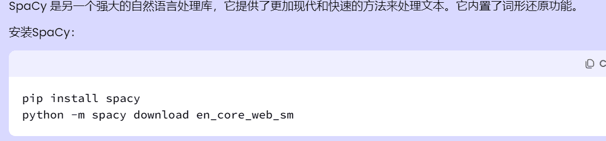

`词达人过班级任务,自学任务`

## 我是周作人,喜欢看鲁迅打周树人,爱吃番茄炒钢丝球。

**目前存在的bug**  
+ 个别单词过不了,建议手动答题后继续运行

## 日志
**2024-06-29**   
简单描述一下现在困境吧:
1. 部署没服务器(不想部署在中文)
2. aws创建一个封一个
3. 计划转postgreSql走vercel

时间过的真快，前后端都写好了,有时间在整。

**2024-05-03**
+ 目前可视化只支持咕噜咕噜(google)浏览器
+ 可视化针对的是用code的用户
+ 奇怪的脑回路JSON.stringify()后存localStorage脑子会变聪明吗？


## 声明

**仅供学习参考**,**仅供学习参考**,**仅供学习参考**,**仅供学习参考**  
**请勿用于非法途径,后果自负**


## 问题

文档已经够详细了,作者啥也不会,比你都呆😳。

## 使用

获取token:   

方法一：获取微信code: 打开pc端微信,点击下面链接(发给自己),查看浏览记录 

1. **如果是截图或者拍照识别(有误差)出来的code一定要检查与链接是否一样**

```angular2html
https://open.weixin.qq.com/connect/oauth2/authorize?appid=wx2a694105a6abbe6d&redirect_uri=https%3A%2F%2Fapp.vocabgo.com%2Fstudent%2F%3Fauthorize%3D0&response_type=code&scope=snsapi_userinfo&state=STATE```
```

code在微信浏览记录里面,且code只能使用一次,且在运行时不能进入词达人(会挤掉),code到config/config.json中    


方法二:  
自己抓包,抓token很简单可以说点击就可以抓,点击这个链接进入词达人(只要不点那个学生端进入就不会掉)可以看实时进度,或者直接使用可视化
```angular2html
https://app.vocabgo.com/student/
```

方法三:
属于下下策，B站上cdr付费使用的软件可以获取token(不如自己抓包)。风险自己承担,远控了我不管哦

**配置运行环境**

> 不想配置环境的话**releases**有打包好的exe程序 

配置环境(**用exe的话**看下面配置config.json)
```angular2html
pip install -r requirements.txt
```
记得安装模型


**配置config.json**

+ 自己配置环境了配置文件在**config/config.json**
+ 用exe在**解压**后的_internal/config/config.json里配置
```angular2html
{
  "token": "", // token和code配置一个就可以了
  "code": "", // 不会抓包的配置这个
  "class_task": true, // 是否完成班级任务
  "myself_task": false, // 是否完成自学任务,默认为否
  "visible": false //是开启可视化测试中

}
```
**运行**
exe:直接cmd把exe拖进去   
下载代码:直接运行main.py

